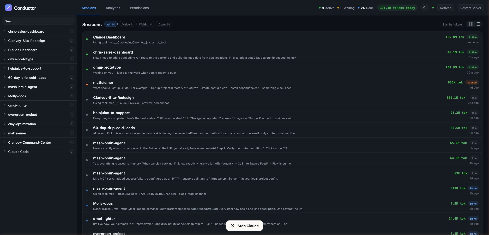
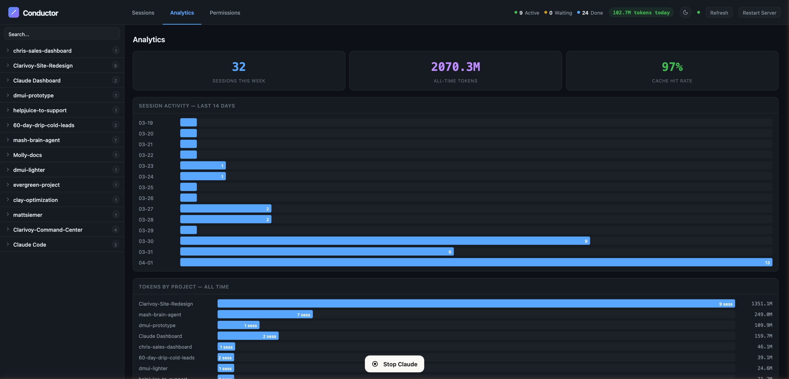
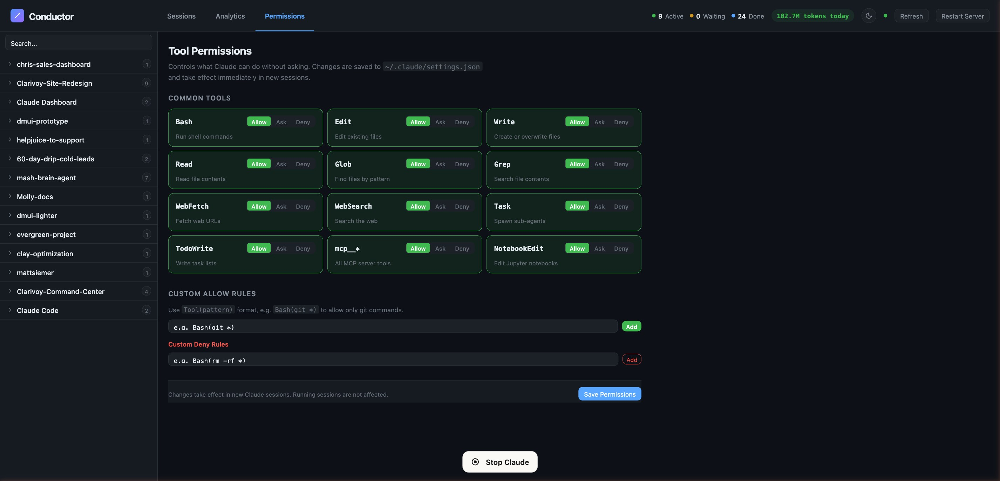

# Conductor

A local dashboard for monitoring and controlling your [Claude Code](https://claude.ai/code) AI agent sessions.





> **macOS only.** Conductor uses macOS LaunchAgents, AppleScript, and PTY signals. Linux/Windows support is not currently available — PRs welcome.

---

## What it does

When you're running multiple Claude Code sessions across different projects, it's hard to know what each agent is doing, how much it's costing, or when it needs your attention. Conductor gives you a single view:

- **Live session feed** — see every active, waiting, and completed session across all your projects
- **Cost tracking** — estimated token cost per session and across your whole account (see note below)
- **Desktop notifications** — get notified the moment any session needs your approval
- **Agent control** — pause, resume, or kill sessions; inject prompts into running agents
- **Permissions manager** — configure which tools Claude can run without asking, via a visual UI for `~/.claude/settings.json`
- **Light & dark mode** — toggle in the header
- **Always-on** — runs as a macOS LaunchAgent, auto-starts on login, restarts on crash

---

## Requirements

- macOS Ventura 13+ (required)
- [Claude Code](https://claude.ai/code) installed and in use
- [Node.js](https://nodejs.org) 18+

---

## Install

```bash
git clone https://github.com/Siemer5000/conductor.git ~/conductor
cd ~/conductor
bash scripts/install.sh
```

Then open [http://localhost:3456](http://localhost:3456).

The install script:
- Detects your Node.js location automatically
- Installs npm dependencies
- Registers a LaunchAgent so the server starts on login
- Compiles a macOS `.app` you can drag to your Dock

### Add to Dock (optional)

After install, drag `~/Applications/Conductor.app` to your Dock for one-click access.

---

## Usage

### Sessions tab
All Claude Code sessions appear here — active, waiting for approval, and completed. Filter by status, sort by spend, switch between grid and list view.

Session names like `compressed-whistling-turing` are Claude's internal identifiers for each conversation — they're generated automatically by Claude Code and aren't configurable.

### Analytics tab
Aggregate token usage and cost broken down by project.

### Permissions tab
Visual editor for Claude Code's `~/.claude/settings.json`. Toggle tools on/off with a click — changes take effect immediately on the next tool call in any active session.

### Agent controls
Click any session to open the detail view. From there you can:
- **Pause / Resume** — sends SIGTSTP/SIGCONT to the Claude process
- **Kill** — sends SIGTERM
- **Inject prompt** — writes text into the agent's terminal input (CLI sessions only)
- **Approve / Deny** — respond to pending permission requests (CLI sessions only)

> **Note:** Approve/Deny and prompt injection work for Claude Code CLI sessions only. Desktop App sessions use an internal Electron IPC channel that external tools cannot reach — use the Permissions tab to pre-authorize tools instead.

---

## About the cost numbers

The `~$X.XX est. tokens` figure in the header is **estimated token cost at Anthropic's published list prices** — it is not your actual bill.

- If you're on **Claude Max plan**, your subscription covers most usage. Only sessions that exceed your plan limits are charged at overage rates.
- If you're on **API billing**, these numbers closely reflect what you'll be charged.

The estimates are calculated from the `usage` blocks in Claude's local JSONL session files — no data is sent to Anthropic or any external service.

---

## Security

Conductor binds to `127.0.0.1` (localhost only). It is not accessible from other devices on your network. No authentication is required because only processes on your local machine can reach it.

---

## Uninstall

```bash
bash scripts/uninstall.sh
```

---

## How it works

Conductor is a Node.js server that:
1. Watches `~/.claude/projects/**/*.jsonl` for live changes using chokidar
2. Parses Claude Code's JSONL session format to extract messages, tool calls, token usage, and process state
3. Serves a WebSocket-connected dashboard at `localhost:3456`
4. Controls agent processes via standard Unix signals and TTY input injection

No data leaves your machine. No API keys required beyond what Claude Code itself uses.

---

## Contributing

PRs welcome. The codebase is intentionally simple — a single `server.js` and a single `public/index.html` with no build step.

---

## License

MIT
